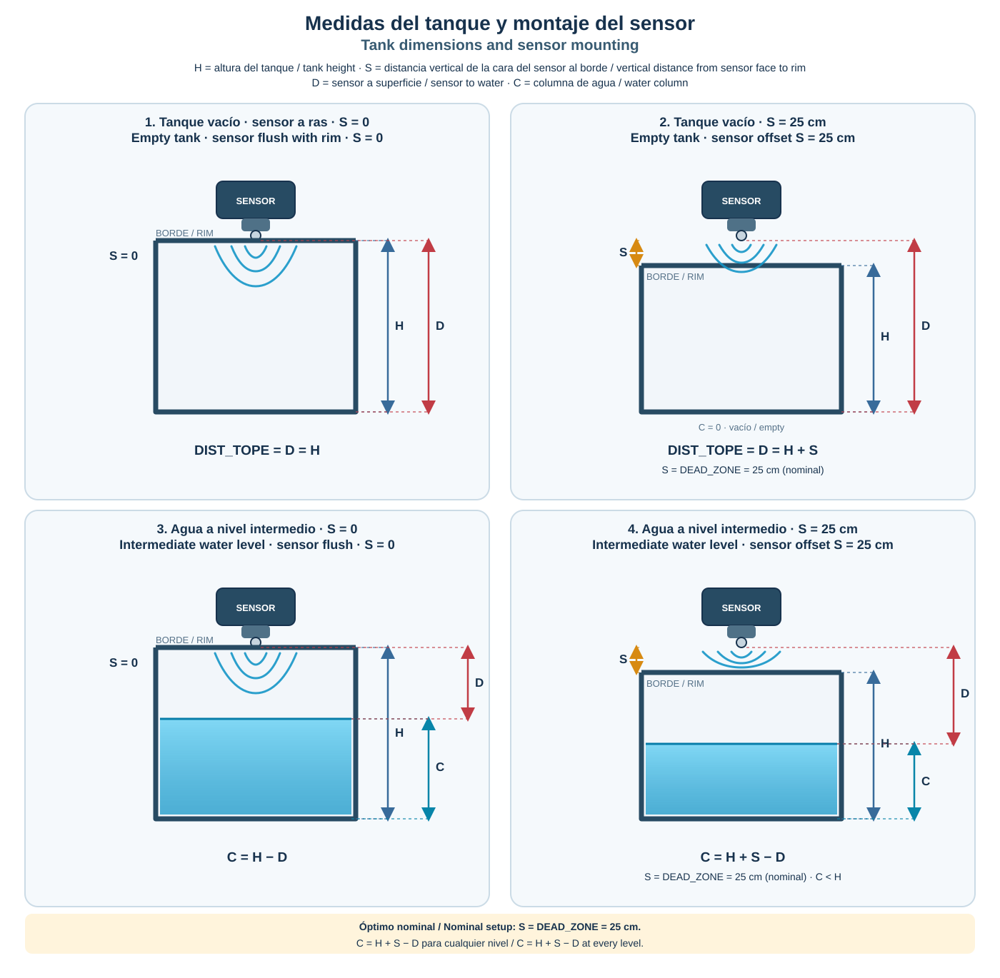
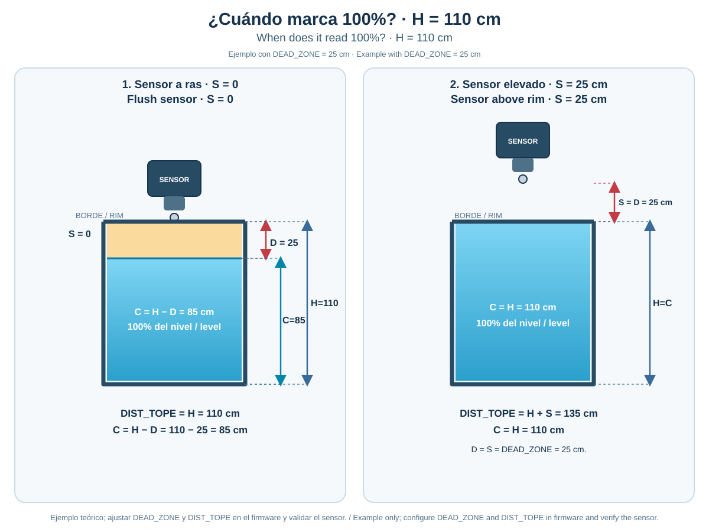

<h1 align="center">
  <br/><strong>Another Level Tank</strong>
  
  <a href="https://github.com/alexminator/ALT_nano/blob/master/README_es.md">
    
  </a>
  <a href="https://github.com/alexminator/ALT_nano/blob/master/README.md">
    
  </a>
</h1>

<a name="readme-top"></a>

<h1 align="center">
  
[](https://github.com/alexminator/ALT_nano/)
[](https://github.com/alexminator/ALT_nano/blob/master/LICENSE)
[](https://github.com/alexminator/ALT_nano/stargazers) 
[](https://github.com/alexminator/ALT_nano/network/members)
[](https://github.com/alexminator/ALT_nano/)
[](https://github.com/alexminator/ALT_nano/)
[](https://github.com/alexminator/ALT_nano/watchers)  
</h1> 

<h4 align="center">:star: Give me one star — it will motivate me to keep improving it!!</h4>

<!-- TABLE OF CONTENTS -->
<details>
  <summary>Table of contents</summary>
  <ol>
    <li>
      <a href="#about-the-project">About the Project</a>
      <ul>
        <li><a href="#goals-of-this-project-">Goals of this project</a></li>
      </ul>
    </li>
    <li>
      <a href="#getting-started">Getting Started</a>
      <ul>
        <li><a href="#component">Component</a></li>
        <li><a href="#installation">Installation</a></li>
        <li><a href="#diagram">Diagram</a></li>
        <li><a href="#build-and-upload">Build and upload</a></li>
      </ul>
    </li>
    <li><a href="#calibration-and-configuration">Calibration and configuration</a></li>
    <li><a href="#operation">Operation</a></li>
    <li><a href="#troubleshooting">Troubleshooting</a></li>
    <li><a href="#to-do">To do</a></li>
    <li><a href="#collaborator">Collaborator</a></li>
    <li><a href="#license">License</a></li>
    <li><a href="#contact">Contact</a></li>
    <li><a href="#open-source-programs">Open Source Programs</a></li>
    <li><a href="#special-thanks">Special thanks</a></li>
  </ol>
</details>

<!-- ABOUT THE PROJECT -->
## About the Project

ALT_nano is an Arduino-based tank monitor. An ultrasonic sensor measures the distance from the sensor to the water surface, and a 20×4 LCD shows the estimated level and volume. A buzzer signals configurable low- and high-level alarms; the button silences an active alarm or wakes the display backlight. This project is a monitoring aid and is not a certified overflow-protection system.

**You can view the demo [here](https://wokwi.com/projects/356392498196222977).**
> **Warning** :
In Wokwi, press **Start** and click the ultrasonic sensor to change its simulated distance. The firmware currently accepts readings from **20 to 104 cm** (`DEAD_ZONE` and `DIST_TOPE`). At 104 cm the tank is treated as empty; a 20 cm reading maps to 100% on the configured scale. For that reading to represent a physically full tank, the sensor offset above the tank rim (`S`) must also be 20 cm, matching `DEAD_ZONE`. The JSN-SR04T documentation specifies a nominal 25 cm blind zone; for a 25 cm mounting offset, set both `S` and `DEAD_ZONE` to 25 cm after confirming reliable readings with your sensor. The displayed 100% is a software scale, not a guarantee that the tank cannot overflow.

### Goals of this project :

- **_24/7 tank level monitoring_**
- **_Avoid spillage of water due to overflow_**
- **_Prevent the tank from being empty and leaving the house without a water supply_**

<a href="#readme-top"></a>

---

<!-- GETTING STARTED -->
## Getting Started

[](https://github.com/alexminator/ALT_nano/)

```js
         .8.          8 8888         8888888 8888888888
        .888.         8 8888               8 8888
       :88888.        8 8888               8 8888
      . `88888.       8 8888               8 8888
     .8. `88888.      8 8888               8 8888
    .8`8. `88888.     8 8888               8 8888
   .8' `8. `88888.    8 8888               8 8888
  .8'   `8. `88888.   8 8888               8 8888
 .888888888. `88888.  8 8888               8 8888
.8'       `8. `88888. 8 888888888888       8 8888

```
### Component

This project uses an Arduino Nano, a 20×4 parallel LCD, an ultrasonic distance sensor, a buzzer, and a push button. The example hardware uses a waterproof **JSN-SR04T** sensor. If you use another sensor, confirm its voltage, range, timing, and minimum reliable distance before connecting it.

The Arduino(Hardware) components required are:

- **Arduino Nano**
- **LCD screen 20x4**
- **A button**
- **A buzzer**
- **A 10 kΩ resistor** (button pull-up)
- **A 10 kΩ potentiometer** (LCD contrast)
- **A waterproof ultrasonic sensor [JSN-SR04T](https://naylampmechatronics.com/img/cms/Datasheets/JSN-SR04T-2-0.pdf)**

<a href="#readme-top"></a>

---

### Installation

*Below is the connection diagram and a table with the pins to be connected.*

| ARDUINO PINS | LCD PINS    |  
| ------------ | ----------- | 
|  12-  `D12`  |   15 - `A`  |
|  11-  `D11`  |   4 - `RS`  |
|  10-  `D10`  |   6 - `E`   |
|  9-  `D9`    |   11 - `D4` |
|  8-  `D8`    |   12 - `D5` |
|  7-  `D7`    |   13 - `D6` |
|  6-  `D6`    |   14 - `D7` |
|    GND       |   16 - `K`  |
|    GND       |   1 - `VSS` |
|   VCC(5v)    |   2 - `VDD` |
| ARDUINO PINS | BUTTON PINS | 
|  3-  `D3`    |   1 - 3     | 
|    GND       |   2 - 4     |  
| ARDUINO PINS | BUZZER PINS |
|  4-  `D4`    |     +       |
|    GND       |     -       |
| ARDUINO PINS | JSN-SR04T   |
|  2-  `D2`    |  `TRIGGER`  |
|  5-  `D5`    |   `ECHO`    |
|   VCC(5v)    |    VCC      |
|    GND       |    GND      |

**LCD setup:** Connect `R/W` (LCD pin 5) to GND. Connect `V0` (pin 3, contrast) to the wiper of a 10 kΩ potentiometer, with its ends connected to 5 V and GND. Adjust the potentiometer until the characters are visible.

> **Button wiring:** This firmware configures D3 as `INPUT` (not `INPUT_PULLUP`). Wire the button and external 10 kΩ pull-up resistor according to the circuit diagram, and verify that the input reads HIGH when idle and LOW when pressed. Do not connect the LCD backlight pin directly if the module's current exceeds the Arduino pin rating; use an appropriate transistor/driver if needed.

### Diagram


> ### :point_right: You can find the diagram [here](https://github.com/alexminator/ALT_nano/blob/master/img/ALT-UNO.fzz). :star:

<a href="#readme-top"></a>
---

## Build and upload

This is a PlatformIO project for an **Arduino Nano ATmega328P**. Install [VS Code](https://code.visualstudio.com/) and the [PlatformIO IDE extension](https://platformio.org/install/ide?install=vscode), open this repository as a project, and allow PlatformIO to install the dependencies listed in `platformio.ini`. Select the Nano ATmega328P board profile (and the correct bootloader/processor variant if your board requires it).

From the PlatformIO terminal, build and upload with:

```sh
pio run
pio run --target upload
```

Select the correct serial port in PlatformIO if it is not detected automatically. To use the command line, install PlatformIO Core and run the same commands from the project directory.

## Code and debugging

The `Tank` library draws the tank animation; `LiquidCrystal` drives a parallel 20×4 LCD; `NewPing` reads the ultrasonic sensor. The other source files handle alarms, sound, custom LCD characters, and diagnostics. The current firmware uses a **parallel LCD**, not an I2C backpack. Switching to I2C requires changing the library, pin wiring, and initialization.

To enable diagnostic serial output, change the definition near the top of `src/main.cpp`:

```cpp
#define DEBUGLEVEL DEBUGLEVEL_DEBUGGING
// #define DEBUGLEVEL DEBUGLEVEL_NONE
```

The serial monitor is configured for **9600 baud**. Available verbosity levels are defined in `src/debug.h`.

The ultrasonic sensor measures **D**, the distance from its face to the water surface. **H** is the tank's internal height (top rim to bottom), **S** is the vertical sensor offset above the rim, and **C** is the water-column height (bottom to water surface). The general formula is **C = H + S − D**. With an empty tank, the sensor measures to the bottom, so **`DIST_TOPE = D = H + S`**.

The diagram compares four cases:

1. **Empty tank, sensor flush:** `S = 0`, `C = 0`, and `DIST_TOPE = D = H`.
2. **Empty tank, sensor 25 cm above the rim:** `S = 25 cm`, `C = 0`, and `DIST_TOPE = D = H + S`.
3. **Water at an intermediate level, sensor flush:** `S = 0`, so `C = H − D`.
4. **Water at an intermediate level, sensor 25 cm above the rim:** `S = 25 cm`, so `C = H + S − D`. The 25 cm offset is the nominal JSN-SR04T blind-zone clearance; verify the actual minimum for your sensor.

For the nominal 25 cm setup, configure `DEAD_ZONE = 25 cm` and `DIST_TOPE = H + 25 cm`.

<figure>
  
  <figcaption>Sensor-to-water distance and tank geometry used by the level calculation.</figcaption>
</figure>

### What 100% means for a 110 cm tank

With `H = 110 cm` and `DEAD_ZONE = 25 cm`, the software's maximum liquid-column scale is `DIST_TOPE − DEAD_ZONE`:

- **Sensor flush with the rim (`S = 0`):** `DIST_TOPE = 110 cm`; at the displayed 100%, `C = H − D = 110 − 25 = 85 cm`. The water is still 25 cm below the rim because the blind-zone distance is subtracted from the tank height.
- **Sensor 25 cm above the rim (`S = 25 cm`):** `DIST_TOPE = H + S = 135 cm`; at 100%, `C = 135 − 25 = 110 cm`. When full, `D = 25 cm` and `C = H = 110 cm`, so 100% coincides with the tank rim.

These are example settings, not the current firmware values (`DIST_TOPE = 104 cm`, `DEAD_ZONE = 20 cm`). Configure and verify the values for the actual tank and sensor before using either scale.

<figure>
  
  <figcaption>Example of the configured 100% point for two sensor mounting heights.</figcaption>
</figure>

### Calibration and configuration

The main settings are in `src/main.cpp`:

| Setting | Current value | Meaning |
| --- | ---: | --- |
| `DIST_TOPE` | 104 cm | Sensor-to-bottom reading when the tank is empty. With **H** as tank height and **S** as sensor offset above the rim, use `DIST_TOPE = H + S` (or directly measure this distance with the tank empty). |
| `DEAD_ZONE` | 20 cm | Minimum accepted sensor distance and distance mapped to 100% by the current software scale. The JSN-SR04T specifies a nominal 25 cm blind zone; the current 20 cm setting is empirical. To map 100% to water at the rim while retaining 25 cm clearance, configure both `DEAD_ZONE = 25 cm` and `S = 25 cm`, then recalculate `DIST_TOPE = H + S`. For example, if **H = 104 cm**, use `DIST_TOPE = 129 cm`. Verify your particular sensor's reliable minimum. |
| `MAX_DISTANCE` | 200 cm | Maximum distance requested from NewPing; must cover the installed tank while remaining within the sensor's range. |
| `NIVEL_BAJO` / `NIVEL_ALTO` | 20% / 100% | Low- and high-level alarm thresholds. |
| `ancho`, `largo`, `tabiqueA`, `tabiqueL` | cm | Rectangular tank and central-partition dimensions used by the volume formula. |

Measure and verify these values with the actual tank and sensor. The current firmware uses `DIST_TOPE = 104 cm` and `DEAD_ZONE = 20 cm`; `DIST_TOPE` is the sensor-to-bottom reading when empty (**H + S**), not necessarily the tank's height. The accepted distance interval is currently **20–104 cm**. Readings closer than the configured minimum or farther than `DIST_TOPE` are treated as invalid. The level is clamped to 0–100%; with `S = DEAD_ZONE`, 100% corresponds to the water reaching the tank rim. If these values differ, 100% is only the configured software scale and will not coincide with a physically full tank. In either case, **100% does not guarantee overflow is impossible**: set the high alarm below the actual overflow point and leave a safe margin.

The current volume formula assumes a rectangular tank with one rectangular central partition that displaces water. For another shape or partition, adapt `Sensor::get_volume()`; the LCD volume will otherwise be inaccurate. The sensor-to-water geometry also assumes the water surface is a suitable ultrasonic target; avoid obstructions, narrow openings, turbulence, and angled surfaces where possible. Validate the displayed volume against a known water quantity before relying on it.

### Operation

- The LCD shows level (%), sensor distance (cm), estimated volume (L), and a tank-fill graphic.
- A low- or high-level alarm is confirmed after **10 consecutive valid readings** at the threshold. Invalid sensor readings are filtered; after **3 consecutive invalid readings**, the display reports a sensor error.
- Hold the button to silence an active alarm. The alarm can sound again after its condition clears and reoccurs.
- A button press wakes the LCD backlight. The backlight automatically turns off after about **60 seconds**; an active alarm wakes it.

### Troubleshooting

| Symptom | Checks |
| --- | --- |
| `ERROR` on the LCD | Check sensor power, common GND, TRIG on D2, ECHO on D5, sensor aim, and whether the measured gap is within `DEAD_ZONE`–`DIST_TOPE`. |
| Level or volume looks wrong | Re-measure `DIST_TOPE` and tank dimensions; confirm cm units and that the tank shape matches the formula in `get_volume()`. |
| Readings jump near the water | Keep the sensor perpendicular to a calm water surface; verify the minimum reliable distance and increase `DEAD_ZONE` if necessary. |
| Alarm does not match the desired level | Adjust `NIVEL_BAJO` / `NIVEL_ALTO`; remember that the alarm also requires 10 consecutive readings. |
| LCD is blank or unreadable | Check LCD power/contrast, the parallel wiring table, and the backlight circuit; verify the Nano board/port before uploading. |

This project is a monitoring aid, not a certified safety or overflow-prevention device. Use an independent float switch or other fail-safe where overflow could cause damage. The ultrasonic sensor, wiring, and electronics must be installed in a suitably protected environment.

<a href="#readme-top"></a>

---

## To do

The following items are ideas for future development; they are **not implemented in the current firmware**.

*Make a universal version of the project that includes the following features.*

**_For the software part:_**

+ Include a menu to configure **ALL** possible variables.
  - Tank type. For an accurate calculation of the volume of water.
      * Cylindrical or rectangular.
  - Tank dimensions. The height of the tank can be entered both manually and automatically.
  - Level to activate the alarm for low and high.
  - Choice of the working mode of the device. 
      * Manual the user makes the decisions. 
      * Automatic when reaching the low level of the tank, the level in the cistern will be measured, if it is sufficient, the pump will be activated and the tank will be filled.
  - Choice of alarm tone.
  - Include the incoming water flow to be displayed on the screen.
  - Choice of information to display on the screen.

**_For the hardware part:_**

+ Being able to use different screens. 
     - LCD.
     - OLED
+ Increase the number of buttons to 3, for easy menu navigation.
+ Add relay module to control the tank filling pump.
+ Add a flow sensor to protect the filling pump and account for the amounts of water entering the tank.
+ Add a second ultrasonic sensor to measure the level of the reservoir and that the filling is automatic when the low level is reached.
+ And finally, if time is enough for me, I can make a version with esp32 that includes an embedded website and do all the control from your mobile.

<a href="#readme-top"></a>

---

## Collaborator

<table style="width:100%">
  <tr>
    <th><b>Alexminator</b></th>
    <th><b>20-EverGreen-2</b></th>
    
  </tr>
  <tr>
    <td align="center"><a href="https://github.com/alexminator"></a></td>
    <td align="center"><a href="https://github.com/20-EverGreen-2"></a></td>
    
  </tr>
  <tr>
    <td align="center"><a href="https://twitter.com/alexminator99"></a> <a href="https://www.facebook.com/alexander.rivasalpizar/"></a> <a href="https://www.linkedin.com/in/alexander-rivas-73532037/"></a><a href="https://t.me/Alexminator"></a></td>
    <td align="center"><a href="https://t.me/Deltatronics"></a></td>
    
  </tr>
</table>

## License

*The ALT project is released under the [MIT](LICENSE) license.*

## Contact

> **_Need help?_** 
**_Feel free to contact me 📨 [alexminator99@gmail.com](mailto:alexminator99@gmail.com?Subject=ALT_nano_issues)_**

[](https://github.com/alexminator/) [](https://twitter.com/alexminator99)

## Open Source Programs
* [VSCODE](https://code.visualstudio.com/) -A source code editor.
* [PlatFormio](https://platformio.org/) - Open programming IDE for C/C++, hardware oriented.

## Special thanks
* _To the Cuban Arduino community._
* _To everyone who gave me his help when I had doubts, especially my son._

<a href="#readme-top"></a>

---
